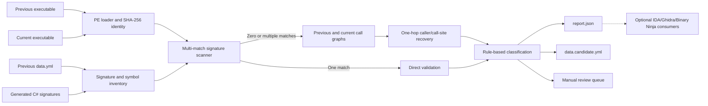
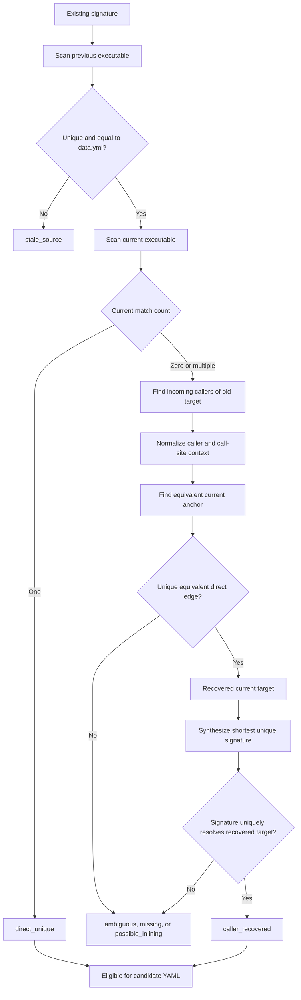

# Patch Revalidation Pipeline Design

- **Date:** 2026-07-27
- **Status:** Approved design
- **Target branch:** `feature/patch-revalidation-research`
- **Baseline:** `upstream/main` at `79126fb25`

## Purpose

FFXIV patch updates move native functions, vtables, instances, and globals. The repository preserves many of those locations in `ida/data.yml` and resolves a smaller, overlapping set through signatures declared in C#. Updating both surfaces is still a patch-day bottleneck that depends heavily on a small number of people and on knowledge that is not recorded as an executable process.

This design defines:

1. a documented patch-revalidation runbook;
2. a standalone C# proof of concept that validates existing signatures and recovers a limited class of broken signatures without requiring IDA, Ghidra, or Binary Ninja.

The tool analyzes files only. It does not attach to, launch, debug, or modify the game.

## Repository Findings

The measurements below were taken from the baseline named above.

### `data.yml` surface

`ida/data.yml` is 27,802 lines and identifies version `2026.06.18.0000.0000`. Its parsed location-bearing surface contains:

| Kind | Count |
| --- | ---: |
| Globals | 118 |
| Global functions | 319 |
| Class instances | 175 |
| Vtables | 3,639 |
| Class functions | 8,347 |
| **Total locations** | **12,598** |

There are also 53 commented `#fail` markers. The file contains 3,856 class keys, 113 of which are empty class stubs, and 1,500 named virtual-function slots.

### Signature coverage

The C# source contains 2,095 `[MemberFunction]`, 106 `[StaticAddress]`, 978 `[VirtualFunction]`, and 91 `[VirtualTable]` declarations. The CExporter output contains 2,129 exported signatures:

- 1,844 member functions;
- 179 static member functions;
- 106 static members.

Matching by native class and member name finds 1,854 signed entries among the 8,347 class functions in `data.yml`, or approximately 22.2% coverage. This is enough for a valuable automatic first pass, but not enough to regenerate the full rename database.

### Contributor concentration

As an approximate measure of patch-update ownership, repository history contains 87 commits that change the `version:` line in `ida/data.yml`:

| Author | Version-changing commits |
| --- | ---: |
| pohky | 61 |
| aers | 24 |
| Other contributors | 2 |

Recent patch version updates are even more concentrated. This does not measure all contributions to the file, but it demonstrates the bus-factor problem for the recurring version transition itself.

### Existing tools

| Tool | Current role | Finding |
| --- | --- | --- |
| `ida/ffxiv_idarename.py` | Applies `data.yml` names, vtables, functions, and instances | Already has adapters for IDA, Ghidra, and Binary Ninja. It consumes updated addresses; it does not discover them. |
| `FFXIVClientStructs.ResolverTester` | Scans a PE with generated C# signatures and compares results with `data.yml` | Strong foundation for the direct pass, but currently an internal utility with a hard-coded default path, first-match semantics, textual output, and no runbook. |
| `InteropGenerator.Runtime/Resolver.cs` | Runtime signature resolution | Fast parallel scanner, but intentionally resolves the first match and does not expose ambiguity. Its runtime behavior must not be changed by the PoC. |
| `ida/ffxiv_sigmaker.py` | Bulk signature generation inside IDA | Marked unmaintained, depends deeply on IDA APIs, and repeatedly searches for uniqueness. It is a good replacement target. |
| `Ghidra/scripts/SigScanner.java` | Interactive Ghidra signature generation | Useful implementation reference, but remains interactive and Ghidra-specific. |
| `ida/ffxiv_data_struct_matcher.py` | Compares selected static-member signatures with `data.yml` inside IDA | Narrow diagnostic script, not a cross-version matcher. |
| `ida/ffxiv_structimporter.py` and `ida/ida_wrapper.py` | Import C#-exported types into IDA | Coupled to the destination type system; not part of patch address discovery. |
| `ida/data-validator.js` | Validates basic YAML shape | Does not validate locations against a binary or signatures against `data.yml`. |
| CExporter workflows | Validate layouts, names, generated YAML, and public API | Do not analyze an FFXIV executable or produce patch-revalidation coverage. |

The remote `upstream/script_rework` branch reorganizes scripts and abstracts some import concerns, but it does not implement binary-to-binary location matching. It should be reviewed for reusable importer work before any overlapping refactor, but it is not a solution to the patch-day diff problem.

## Operator Knowledge to Preserve

User-supplied Discord discussions describe a recurring manual recovery method:

1. locate the old target in the previous executable;
2. move outward to a stable caller or call-site;
3. locate that caller or call-site in the new executable;
4. follow the equivalent call edge back to the new target;
5. inspect manually when parameters changed, the compiler inlined the target, or the graph shape changed.

This is useful process knowledge and directly motivates one-hop call-graph recovery. It is a heuristic, not evidence for a native name, owner, ABI, or declaration. Every recovered candidate must retain the exact anchors and graph edges that produced it.

## Goals

- Run locally from two user-supplied `ffxiv_dx11.exe` files.
- Keep both executables on the user's machine.
- Inventory every signature generated from the C# declarations.
- Distinguish zero, one, and multiple signature matches.
- Validate old matches against the previous `data.yml` address.
- Recover a broken function signature through one direct caller/call-site hop when the evidence is unique.
- Generate a new, uniquely validated signature for a recovered target.
- Produce deterministic `report.json` and `data.candidate.yml` artifacts.
- Preserve YAML comments, ordering, and unrelated text.
- Record enough evidence that another contributor can reproduce and review every accepted candidate.
- Use only synthetic binary fixtures in CI.

## Non-goals for the Proof of Concept

- Recover all 12,598 `data.yml` locations.
- Infer native owners, names, parameters, return types, or ABI.
- Confirm functions that appear to have been inlined.
- Recover indirect calls or arbitrary tail calls.
- Reconstruct unsigned vtables, instances, or globals.
- Edit C# declarations automatically.
- Replace `ida/data.yml`.
- Require IDA, Ghidra, Binary Ninja, Rizin, or a debugger.
- Attach to or automate the running game.
- Commit, push, or publish generated candidates automatically.

## Technical Approach

### Alternatives considered

#### Standalone C# core — selected

Evolve `FFXIVClientStructs.ResolverTester` into `FFXIVClientStructs.PatchAnalyzer`. Reuse the generated signature inventory and the repository's PE/signature knowledge, while adding an analyzer-specific multi-match scanner and an x64 decoder.

Use the Iced package behind a narrow decoder interface for the PoC. Iced is pure C#, MIT-licensed, exposes control-flow and operand information, and is compatible with the repository's .NET target. Its most recent NuGet release is from 2024, so the dependency must be isolated and covered by byte-level fixtures.

The decoder choice was smoke-tested read-only against FFXIV build `2026.06.18.0000.0000`, SHA-256 `4236E770E673150E85F8D10BEAB2FC4834C82F86AAB8A555A9175439FC906A6D`. A diagnostic linear pass with Iced 1.21 advanced through approximately 7.76 million decode steps across 172,905 x64 runtime-function ranges without crossing a range boundary. It also encountered tables and padding embedded in `.text`; this pass demonstrates compatibility with the current binary's instruction encoding, but it does not prove that every covered byte is code. The production preflight therefore validates reachable instructions from accepted function entries and signature anchors instead of requiring every byte in a runtime-function range to decode as code.

References:

- <https://www.nuget.org/packages/Iced/>
- <https://github.com/icedland/iced>

#### Zydis

Zydis is the primary alternative instruction decoder. It is an actively maintained, MIT-licensed C11 x86/x64 decoder with detailed instruction metadata and no third-party runtime dependencies.

It is not selected for the C# PoC because the project publishes official Rust and Python bindings but no official .NET binding. Using it would add a repository-owned P/Invoke layer, native Windows artifacts, architecture-specific packaging, and a second build/toolchain boundary. The `InstructionDecoder` abstraction intentionally preserves the option to replace Iced with Zydis if a future FFXIV build exposes an Iced coverage gap or Iced maintenance becomes unacceptable.

Reference:

- <https://github.com/zyantific/zydis>

#### Ghidra headless

Ghidra headless does apply to this problem. It can import each PE, run auto-analysis, and execute ordered pre- and post-analysis scripts without opening the UI. That makes it a credible optional enrichment backend or oracle for function discovery, xrefs, switch recovery, and low-confidence comparisons. Ghidra also has a separate Version Tracking feature, although this design does not assume an off-the-shelf headless command that performs the complete old-to-new mapping; a reproducible integration would still require repository-owned scripts, analyzer settings, and an export contract.

It is not selected as the required core because it retains a heavyweight external installation, analysis-project lifecycle, Java version, analyzer configuration, and tool-version dependency. Its output and runtime must be benchmarked on the FFXIV corpus before it can influence automatic candidate acceptance. The standalone C# pass remains the deterministic fast path; Ghidra-derived evidence may be added later without making Ghidra a patch-day prerequisite.

References:

- <https://ghidra.re/ghidra_docs/api/ghidra/app/util/headless/HeadlessAnalyzer.html>
- <https://github.com/NationalSecurityAgency/ghidra/tree/master/Ghidra/Features/VersionTracking>

#### IDADiffCalculator-NG

`IDADiffCalculator-NG` is an IDA C++ plugin whose current implementation exports an analyzed database into text snapshots. Its selectable outputs include image base, segments, strings, xrefs, disassembly and operand metadata, function ranges, globals and inferred types, names, MSVC RTTI, and vtables.

Despite its name, the inspected implementation does not compare two exports or recover moved locations. It is interactive, calls IDA SDK analysis APIs, and therefore inherits the IDB/IDA dependency this project is trying to remove from the required path. Several exporters walk addresses one byte at a time, and the assembly export changes IDB operand-display state before warning the operator to close without saving. Those properties make it unsuitable as the implementation of a fast, read-only core.

Its value is architectural: it demonstrates a useful tool-neutral `AnalysisSnapshot` boundary between an analysis producer and a separate cross-version matcher. It may also serve as an optional oracle when comparing PatchAnalyzer's function, xref, RTTI, and vtable extraction against an already reviewed IDB.

The repository currently contains no published license, so its code must not be copied or ported. Only independently implemented concepts and output categories may be considered.

Reference:

- <https://github.com/usernameak/IDADiffCalculator-NG>

#### Rizin

Rizin supports PE/PE+, headless scripting, and `rz-diff`. It may be benchmarked later as an optional backend.

It is not selected for the PoC because it adds an external executable and API boundary, and its function-matching quality for this corpus has not been established.

Reference:

- <https://github.com/rizinorg/rizin>

## Architecture



### Component boundaries

#### `PeImage`

- Opens a PE32+ AMD64 image read-only.
- Exposes image base, image size, section metadata, `.text`, and `.pdata`.
- Computes SHA-256 and reads file version metadata.
- Reads a sibling `ffxivgame.ver` when available.
- Converts file offsets, RVAs, and preferred-base VAs explicitly.
- Rejects malformed or incompatible images before analysis.

#### `SignatureInventory`

- Registers the generated `Address` definitions in a fresh CLI process.
- Snapshots name, pattern, mask, and relative-follow offsets without invoking the runtime resolver.
- Correlates generated names with `data.yml` classes, functions, first instances, and primary vtables using explicit mapping rules.
- Reports generated signatures that have no `data.yml` mapping instead of discarding them.
- Permits synthetic inventories in tests without loading generated addresses.

#### `SignatureScanner`

- Is analyzer-specific and does not change `InteropGenerator.Runtime.Resolver` semantics.
- Scans executable sections with wildcard masks.
- Returns all matches up to a documented safety limit.
- Applies relative-follow offsets with checked arithmetic and section bounds.
- Records both the pattern match RVA and the final resolved RVA.
- Reuses a decoded or indexed search space rather than rescanning the file independently for every symbol.

#### `InstructionDecoder`

- Provides a small repository-owned abstraction over Iced.
- Exposes instruction length, flow-control kind, branch target, displacement/immediate byte ranges, and RIP-relative target.
- Does not expose Iced types outside the adapter.
- Allows replacement by another decoder without changing matching or reporting code.

#### `FunctionIndex`

- Uses x64 `.pdata` runtime-function records as the primary source of function ranges.
- Treats those ranges as unwind coverage and candidate boundaries, not proof that every covered byte is executable code.
- Accepts a candidate entry for graph evidence only when recursive decoding from its begin RVA completes without a reachable invalid instruction and every recorded call-site lies on a reachable basic block.
- Marks a range suspect when entry decoding fails; suspect ranges remain available as containment metadata but cannot support an automatically accepted candidate.
- Excludes embedded tables and padding from instruction coverage metrics.
- Marks leaf functions and addresses without unwind metadata as incomplete rather than inventing boundaries.
- Provides exact containment and function-start queries.

#### `CallGraphBuilder`

- Recursively decodes reachable basic blocks from `.pdata` entries that pass entry validation and from trusted signature anchors.
- Never linearly decodes every byte in `.text` or assumes fallthrough through embedded tables, padding, returns, exceptions, interrupts, or indirect branches.
- Indexes direct relative calls and supported unconditional tail jumps.
- Records source function, call-site RVA, target RVA, and normalized instruction context.
- Excludes indirect calls from PoC recovery but reports their presence.
- Treats an invalid instruction reached from a trusted entry as a symbol-local decoder diagnostic; invalid bytes found only in unreachable data do not fail the run.

#### `DirectMatcher`

- Requires an old unique match that agrees with the previous `data.yml` address.
- Scans the current executable and classifies zero, one, or multiple matches.
- Produces `direct_unique` only for a unique current match with valid relative-follow results.

#### `CallerRecoveryMatcher`

- Starts from a known old target and gathers direct incoming callers.
- Prefers callers already anchored by a generated signature that resolves uniquely in both images.
- Otherwise normalizes a bounded instruction window around the old call-site.
- Locates a unique equivalent caller/call-site in the current executable.
- Follows the equivalent direct edge to a current target.
- Records every considered anchor, rejected ambiguity, and final edge.
- Does not claim recovery when the equivalent edge is absent or indirect.

#### `SignatureSynthesizer`

- Masks branch displacements, RIP-relative displacements, relocatable addresses, and selected immediates using decoder-provided byte ranges.
- Attempts a function-entry signature first.
- Falls back to a direct call-site signature with the repository-compatible relative-follow offset.
- Grows by complete instructions until the pattern is unique or the configured maximum is reached.
- Validates the final suggestion with `SignatureScanner`.
- Emits the suggestion only when it resolves uniquely to the recovered target.

#### `CandidateClassifier`

Uses explainable statuses instead of an opaque confidence percentage.

| Status | Meaning | Candidate YAML |
| --- | --- | --- |
| `direct_unique` | Existing signature is unique in both images and old result agrees with `data.yml` | Apply |
| `caller_recovered` | Unique old anchor maps to a unique current call edge and a new unique signature resolves the target | Apply |
| `stale_source` | Old signature result does not agree with the previous `data.yml` location | Do not apply |
| `ambiguous` | Pattern, caller, call-site, or target has multiple valid candidates | Do not apply |
| `missing` | No usable current candidate was found | Do not apply |
| `possible_inlining` | An old call edge has no equivalent direct current edge | Do not apply |
| `not_in_data` | Generated signature has no corresponding `data.yml` entry | Do not apply |
| `unsupported` | Required edge or location kind is outside PoC scope | Do not apply |
| `analysis_error` | A symbol-local parser or decoder failure occurred | Do not apply |

Multiple independent anchors that converge on the same target are retained as supporting evidence but do not weaken any mandatory uniqueness rule.

#### `ReportWriter`

- Produces schema-versioned JSON.
- Sorts symbols by stable generated name.
- Writes atomically.
- Does not include full personal filesystem paths.

#### `CandidateYamlWriter`

- Starts from the exact source text.
- Replaces only the address token associated with an accepted symbol.
- Preserves comments, order, blank lines, and unrelated formatting.
- Adds a prominent generated/incomplete header.
- Updates `version` only from a reliable sibling version file or explicit CLI override.
- Refuses duplicate or textually ambiguous replacements.
- Never writes to the input path.

## Matching Flow



Internally, all locations are RVAs. Preferred-base VAs are rendered only where needed for `data.yml` compatibility. Runtime process addresses are never accepted as inputs or emitted as evidence.

## Command-Line Contract

```powershell
dotnet run --project .\FFXIVClientStructs.PatchAnalyzer -- analyze `
    --previous-exe C:\builds\previous\ffxiv_dx11.exe `
    --current-exe C:\builds\current\ffxiv_dx11.exe `
    --data .\ida\data.yml `
    --out .\artifacts\patch-analysis
```

Required options:

- `--previous-exe`
- `--current-exe`
- `--data`
- `--out`

Version behavior:

- Read `ffxivgame.ver` next to each executable when present.
- Accept explicit `--previous-version` and `--current-version` overrides.
- Record the source of each version value.
- Warn and preserve the old YAML version when no reliable current version exists.

Exit behavior:

- `0`: analysis completed and artifacts were written, including when manual-review items exist;
- `2`: invalid input or preflight failure;
- `3`: fatal internal analysis failure.

Per-symbol errors do not abort the run. They produce `analysis_error`.

## Artifact Contract

### `report.json`

Top-level information:

- schema version;
- run status;
- tool and repository version;
- binary identities and version sources;
- analysis configuration;
- deterministic workload counts by stage;
- counts by status;
- artifact paths relative to the output directory.

Elapsed stage timings are written to the operator console only. They are deliberately excluded from `report.json` so identical inputs and configuration produce byte-identical review artifacts.

Per-symbol information:

- stable generated name and mapped native name;
- location kind;
- original signature and relative-follow offsets;
- previous `data.yml` preferred VA and RVA;
- previous and current match lists;
- final status and rule conditions;
- recovered target when present;
- caller/call-site anchors and normalized-window hashes;
- suggested signature and validation match count;
- symbol-local diagnostics.

### `data.candidate.yml`

- Contains the complete source YAML text so it can be inspected with existing tooling.
- Starts with a generated, incomplete, review-required header.
- Changes only accepted address tokens and, when reliable, the version line.
- Retains unresolved old addresses visibly; the file is not considered ready to import merely because it parses.
- Is never generated after a fatal analysis failure.

## Failure Handling

### Preflight failures

The tool exits before artifact generation when:

- an input does not exist or is unreadable;
- the executables have the same SHA-256;
- an executable is not PE32+ AMD64;
- required sections are absent or invalid;
- the YAML cannot be parsed;
- output would overwrite an input.

### Symbol-local failures

Checked arithmetic, decode failures, unsupported edges, missing function bounds, and YAML correlation failures are captured per symbol. Analysis continues for independent symbols.

### Fatal analysis failures

An invariant failure in PE indexing, graph construction, or artifact construction produces an atomic `report.json` with `runStatus: failed` and no candidate YAML.

Ctrl+C cancellation does not leave a partially renamed artifact.

## Testing Strategy

No FFXIV executable or extracted game bytes are committed or used in CI.

### Unit tests

- wildcard parsing and validation;
- zero, one, and multiple matches;
- checked relative-follow chains;
- RVA, preferred-VA, and file-offset conversions;
- `.pdata` parsing and containment;
- instruction masking;
- direct call and supported tail-jump extraction;
- deterministic normalized windows;
- candidate classification;
- exact YAML token replacement and ambiguity refusal.

### Synthetic integration fixtures

Tests construct minimal PE32+ AMD64 images in memory with controlled `.text` and `.pdata` sections.

Required scenarios:

1. offsets move but the original signature remains valid, producing `direct_unique`;
2. the target prologue changes while a caller context remains stable, producing `caller_recovered`;
3. two equivalent anchors exist, producing `ambiguous`;
4. the old call is absent, producing `possible_inlining` or `missing`;
5. the old signature conflicts with the YAML address, producing `stale_source`;
6. relative-follow offsets resolve a call-site signature;
7. comments and ordering survive candidate-YAML generation;
8. identical runs produce byte-identical JSON and YAML.
9. a runtime-function range containing an embedded jump table does not decode the table as instructions;
10. an invalid instruction reachable from a trusted entry produces `analysis_error`, while invalid bytes in unreachable padding do not.

### Local real-binary smoke test

When an operator has both builds locally, the runbook may include a non-CI smoke test. The report records hashes and aggregate results, not binaries or unrelated extracted bytes. Sharing the report requires reviewing it for personal paths before publication.

### Performance

Every stage measures elapsed time for the operator console and records deterministic counts of bytes, instructions, patterns, and graph edges in `report.json`.

The initial non-CI goal on a documented reference machine is:

- direct signature pass completes in seconds;
- full PoC completes in under one minute.

These are measurement goals, not variable hosted-runner gates. A stable benchmark baseline must exist before enforcing performance regression thresholds.

## Proposed Source Layout

```text
FFXIVClientStructs.PatchAnalyzer/
  Program.cs
  Cli/
  Analysis/
  Binary/
  Decoding/
  Matching/
  Output/

FFXIVClientStructs.PatchAnalyzer.Tests/
  Fixtures/
  Unit/
  Integration/
```

The existing `FFXIVClientStructs.ResolverTester` project will be renamed or replaced by the analyzer project. Its useful signature-registration and YAML-correlation behavior will be preserved through focused components rather than copied as one top-level program.

The test project will be separate from `InteropGenerator.Tests` because it tests binary analysis and artifact generation, not source-generator snapshots.

## Patch-Day Runbook

1. Retain the previous executable and its SHA-256 before updating the game.
2. Obtain the current executable and its adjacent `ffxivgame.ver`.
3. Start from the `data.yml` corresponding to the previous executable.
4. Run PatchAnalyzer with explicit old/new/data/output paths.
5. Confirm the binary identity block and previous-version agreement.
6. Review summary counts in `report.json`.
7. Review every `caller_recovered` entry and its anchor evidence.
8. Copy suggested C# signatures only after static inspection confirms owner and ABI.
9. Review the textual diff between `data.yml` and `data.candidate.yml`.
10. Resolve manual items with IDA, Ghidra, Binary Ninja, or another static tool as needed.
11. Run `data-validator.js`, build, generator tests, formatting, and CExporter.
12. Commit only reviewed declarations and data changes; never commit executables or local reports containing personal paths.

## Acceptance Criteria

The PoC is complete when:

- the solution builds from a clean checkout;
- existing generator tests remain green;
- PatchAnalyzer has a dedicated passing test project;
- every generated C# address definition is inventoried;
- the scanner reports zero, one, and multiple matches;
- synthetic fixtures demonstrate both `direct_unique` and `caller_recovered`;
- a recovered target receives a unique, revalidated signature suggestion;
- `report.json` is deterministic and contains the required evidence;
- `data.candidate.yml` preserves source formatting and changes only accepted tokens;
- no input file is overwritten;
- no external RE tool or game process is required;
- the documented runbook can be followed by a contributor who did not author the analyzer.

## Follow-on Phases

These phases are separate future designs:

1. expand graph recovery beyond one direct hop;
2. add normalized whole-function fingerprints and graph voting;
3. cover unsigned `data.yml` functions, vtables, instances, and globals;
4. expose report-import adapters for IDA, Ghidra, and Binary Ninja;
5. define a versioned, tool-neutral `AnalysisSnapshot` contract and evaluate optional IDA/Ghidra exporters against it;
6. evaluate Ghidra Version Tracking or Rizin as optional comparison backends;
7. benchmark a Zydis decoder adapter if Iced compatibility or maintenance becomes a blocker;
8. add stable performance-regression gates after collecting representative local benchmarks.
